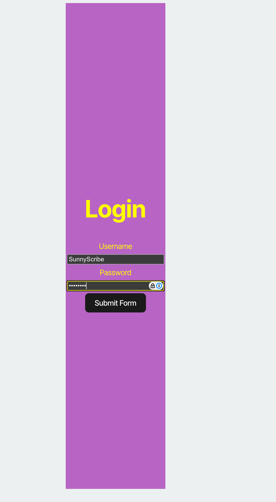
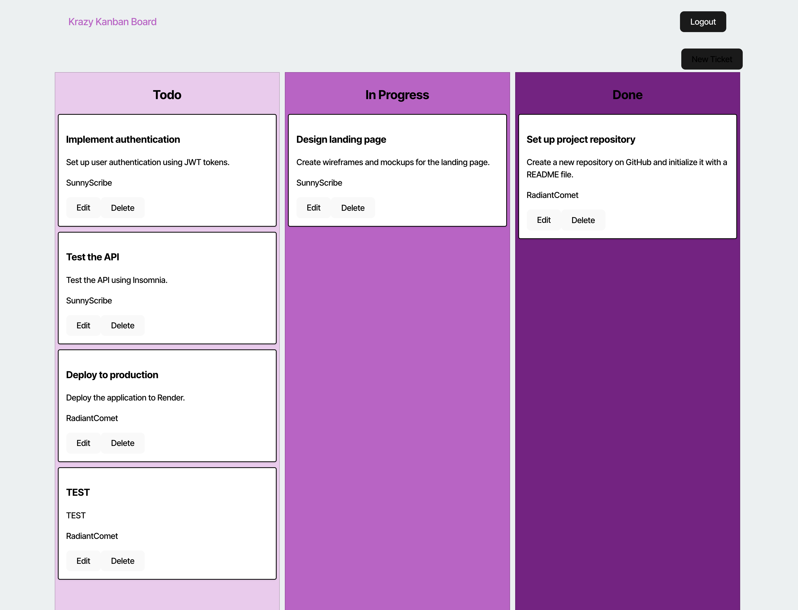

# Kanban-board

## Description
Track my team's work using Agile best practices like Kanban.

## Table of Contents
- [Kanban-board](#kanban-board)
  - [Description](#description)
  - [Table of Contents](#table-of-contents)
  - [Installation](#installation)
  - [Usage](#usage)
  - [Credits](#credits)
  - [Questions](#questions)
  - [License](#license)

## Installation
1. Go to the website: https://kanban-board-8dbs.onrender.com/

## Usage
1. Go to https://kanban-board-8dbs.onrender.com/.
2. Go to 'Login.'
3. Type in the credentials
- username = SunnyScribe
- password = password

4. Submit and see the kanban board populate.

## Credits
I welcome contributions to our project. Please see the [Contributing](#contributing) section.

## Questions
Please direct all questions to me, [flynno-io](https://github.com/flynno-io) on Github. You can also reach me by email at luke.laz.flynn@gmail.com. Please include your name, email and, questions in your email. Thanks!

## License
Licensed under the [MIT](LICENSE.txt) license.
